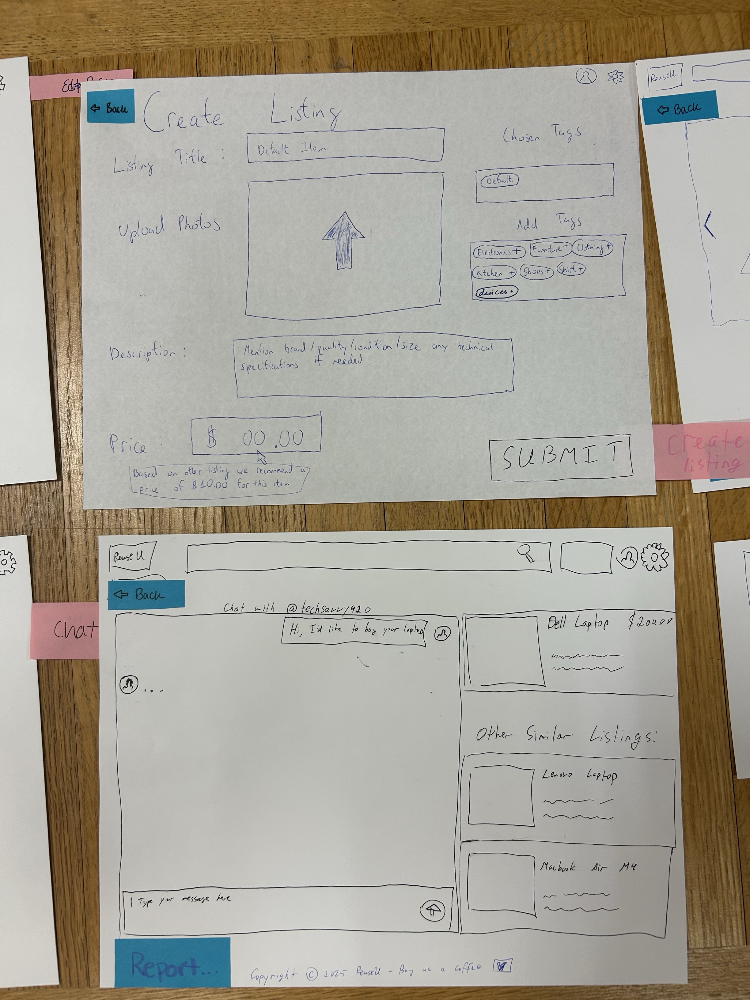
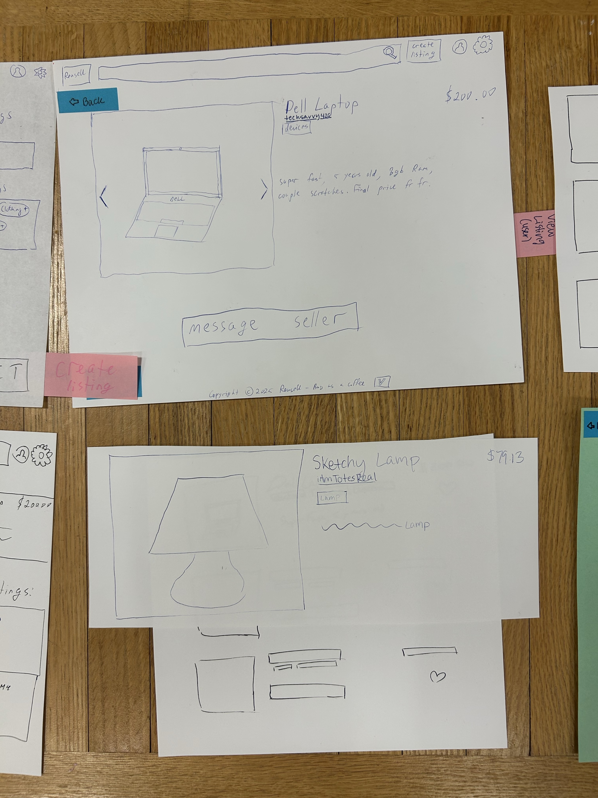
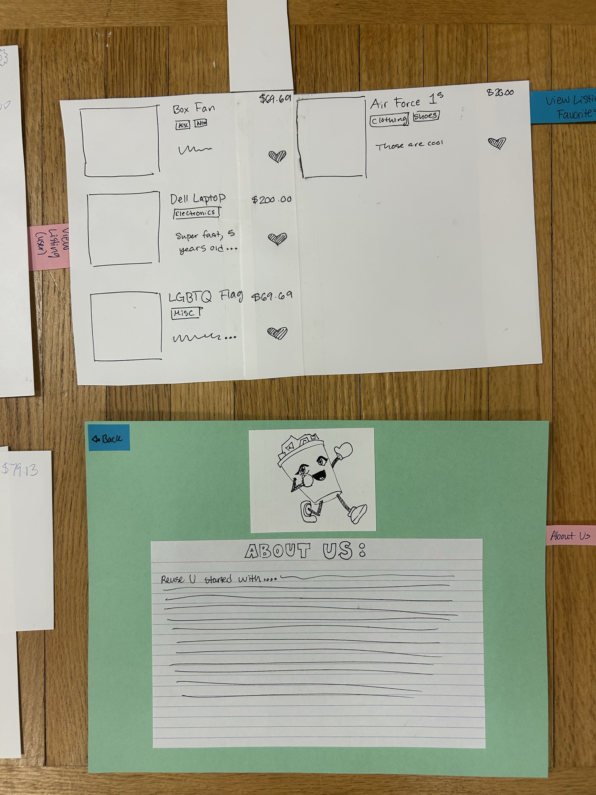

# Sprint 1 Journal

## Part 1: Revising requirements based on feedback
   
 Navigate to ReuseU/milestones/ to see updates to our requirements document in milestone 1.

## Part 2: Use Cases

Use Case  1   (Timur)            
| Section             | Description                                                                                                                               |
| ------------------- | ----------------------------------------------------------------------------------------------------------------------------------------- |
| Actor               | Lucy (she/her)  Merchant/ Casual User / Not Tech Savvy / Does not need her old phone                                                      |
| Goal                | Add items to sell quickly.                                                                                                                |
| Trigger             | Lucy decides she wants to sell an item of hers (e.g. phone) and takes some pictures of it to upload on ReuseU.                            |
| Preconditions       | Lucy has a specific item in mind to sell, and she has at least one photo of it.                                                           |
| Postconditions      | Lucy can see her phone as an active listing on her listings page.                                                                         |
| Flow                | Sign up / Login > Create a Listing > Upload Photos, put up descriptions and price > Submit > Check the listing as active in "My Listings" |
| Alternative Flow  A | Lucy does not know the price she should charge for the phone. The website offers a suggestion  for her when she creates a listing.        |
| Alternative Flow B  | Lucy wants to check the listing is active by searching it up instead of finding it in her active listings                                 |

 Use Case  2  (Trung)

| Section          | Description                                                                                                                                             |
| ---------------- | ------------------------------------------------------------------------------------------------------------------------------------------------------- |
| Actor            | Jack (he/him) Casual User / First Year Student. Budget-conscious. Needs to furnish his dorm quickly and cheaply.                                        |
| Goal             | Jacks wants to find a lamp, is durable enough to last and can fits his budget                                                                           |
| Trigger          | With classes starting soon, Jack’s urgency to furnish his dorm drives him to use ReuseU.                                                                |
| Preconditions    | Jack must be a registered, logged-in user with his college-email                                                                                        |
| Postconditions   | Jack sends a message to a seller, the transaction happens offline                                                                                       |
| Flow             | Logging in and navigating to the item; Sorting by price and browse listing; Check details and seller legitimacy; Message the seller to arrange a meetup |
| Alternative Flow | Jacks skips unverified seller and look for different listings                                                                                           |

Use Case  3    (Howie)           
| Section          | Description                                                                                                                 |
| ---------------- | --------------------------------------------------------------------------------------------------------------------------- |
| Actor            | Dexter (he/him) - Casual User, Needs a new Laptop after his current one ran out of storage                                  |
| Goal             | Dexter wants to efficiently browse and track laptop listings to find good deals                                             |
| Trigger          | Dexter visits the site to check for new laptop listings                                                                     |
| Preconditions    | Dexter has an account and is logged in. Listing for a laptop exists on the platform.                                        |
| Postconditions   | Dexter can view laptop listings, check their condition via photos, save interesting ones, and revisit later                 |
| Flow             | Dexter navigates to the marketplace, filters to display laptops, inspects conditions using provided images, saves listings. |
| Alternative Flow | If no listings match the filters, Dexter adjusts search criteria/looks for new things or just logs out.                     |

 Use Case  4  (Sofia)
   
| Section          | Description                                                                                                                                                                                                                                                                                                                                                                                                            |
| ---------------- | ---------------------------------------------------------------------------------------------------------------------------------------------------------------------------------------------------------------------------------------------------------------------------------------------------------------------------------------------------------------------------------------------------------------------- |
| Actor            | Chara (she/her) - Casual User, Merchant, Hoarder                                                                                                                                                                                                                                                                                                                                                                       |
| Goal             | Chara is trying to get rid of her precious items to a trusted community/platform since she graduated                                                                                                                                                                                                                                                                                                                   |
| Trigger          | Chara is pressured by her familty to get rid of the clutter from her room as she is graduating and can't fit everything from her room in her car.                                                                                                                                                                                                                                                                      |
| Preconditions    | Chara needs to be login in using an account from her college email.                                                                                                                                                                                                                                                                                                                                                    |
| Postconditions   | Chara needs to see the about page, create a listing, cancel a listing, and look at people's profiles                                                                                                                                                                                                                                                                                                                   |
| Flow             | Chara needs to make sure the website she wants to sell her precious items from has good intentions, so she navigates to the about page. Afte reading the about page she creates a listing for a hello kitty squishmellow from a free cost. After a buyer attempts to buy she looks at their profile to see if they had a high rating. She sees the high rating and accepts the requests and sends the buyer a message. |
| Alternative Flow | Chara sees that the user trying to buy her item has a poor buyer rating. She cancels the buy requests and relists the item so someone else can buy it.                                                                                                                                                                                                                                                                 |

Use Case  5    (Peter)          
| Section           | Description                                                                                                                                                                                                                                                                                                                                                         |
| ----------------- | ------------------------------------------------------------------------------------------------------------------------------------------------------------------------------------------------------------------------------------------------------------------------------------------------------------------------------------------------------------------- |
| Actor             | Arsene (he/him) - Hardcore User, Merchant, Finance Guru                                                                                                                                                                                                                                                                                                             |
| Goal              | Arsene wants to turn a profit using the marketplace. Ideally he buys items for cheap and sells the for a profit                                                                                                                                                                                                                                                     |
| Trigger           | Arsene hears about a booming new used marketplace and is excited for a new opportunity to use his finance trading skills                                                                                                                                                                                                                                            |
| Preconditions     | Arsene must be a registered, logged-in user with his college-email and has a method in mind to find underpriced items                                                                                                                                                                                                                                               |
| Postconditions    | Arsene can use different filters, look at similar items to determine the true used value, can create and track listings                                                                                                                                                                                                                                             |
| Flow              | Arsene logs in, and filters the items with the lowest price. He then searches for similar items to the one that appeals to him to determine the true price. He then navigates back to his profile, where he can determine items he has both bought and sold. The prices for both bought and sold items are displayed, allowing Arsene to keep track of his profits. |
| Alternative Flow1 | Arsene's account gets permanently banned due to siginificant reports because he refuses to sell items in person for the listed price.                                                                                                                                                                                                                               |

  Use Case  6  (Krishna)
   
| Section          | Description                                                                                                                                                                                                                                                                                  |
| ---------------- | -------------------------------------------------------------------------------------------------------------------------------------------------------------------------------------------------------------------------------------------------------------------------------------------- |
| Actor            | Chamomile (xi, xir) - Consumer, Hardcore User                                                                                                                                                                                                                                                |
| Goal             | Chamomile wants to be able to use the website with the lowest specs available, while also being able to communicate with a large amount of people at once. Xir goal is to communicate with people for information on products and people in need of certain items in order to turn a profit. |
| Trigger          | Short on cash and possessing only low-end technology, Chamomile sees an opportunity to gain profit with this new marketplace and improve his situation.                                                                                                                                      |
| Preconditions    | Having enrolled at Grinnell, Chamomile has access to an account with the site, and a means of communicating with collaborators.                                                                                                                                                              |
| Postconditions   | Chamomile can check listings and buy and sell based on the information given by the collaborators.                                                                                                                                                                                           |
| Flow             | Chamomile logs in, and goes to the chat where xi can communicate with xir 40 collaborators. The group exchanges information, then Chamomile returns to the home page to begin his buying and selling efforts.                                                                                |
| Alternative Flow | Chamomile finds xirself with a banned account after xi keeps forgetting to meet xir buyers in person.                                                                                                                                                                                        |

## Part 3: Paper Prototype

### Photos:

### Use Cases Modeled:

1. Use case 1, Lucy creating a listing to sell a phone and then check that it's active
2. Use case 2, Jack finding a lamp from a verified/non-suspicious user that is within his budget.
3. Use case 3, Dexter searching for laptops on ReuseU, checking their conditions through photos, and favoriting listings.

### Demonstrations:

Demonstrations of all three use cases were held in class on February 24th with Destany (da) Best.

## Part 4: Test and revise (practice)

For this part, we tested our prototype with Destany, who was the first person to ever experience our paper website. We prepared a preliminary prototype with multiple pages, set up all of the prototype's components, decided on the team roles for the test and invited Destany to test it during class. The team members took on the following roles during this test:
1. Trung - note taker, wrote down all the feedback and suggestions from Destany (and the team) during the test
2. Howie - also a note taker, same as above.
3. Sofia - facilitator, helped change pages/elements of the website as Destany was interacting with it.
4. Krishna - was involved in creating the Storyboard, otherwise observed the test and offered feedback too.
5. Peter - video recorder.
6. Timur - facilitator also, same as Sofia.

### A short synapsis of the test:
Destany immediately decided to test our website to the limit and decided to create the account instead of logging in with an existing one (our sign up procedure wasn't yet developed at the time but the log in was). She then proceeded to play along with filters and the interface, clicked on a couple listings and was able to message a user she wasy trying to a buy an item for. Destany succesfully pointed out many underdeveloped parts of our prototype and gave us a lot of new elements to develop over the next couple of days. At the time, Lucy's story about creating a listing was activated, as well as Dexter's story about buying a laptop.

### Specific feedback received:
Below are some examples of the specific feedback we received from Destany:

* Noted that there should be a button to create a listing. 
* Wanted filters visible from the start. 
* Disliked blocks on green background, but noted design is subjective. 
* Asked if items can be given for free. 
* Wanted to see an about page. 
* Wanted to see recommended products. 
* Wanted to see more design elements. 
* Asked if there is a rating system or report button for bad actions.

### Changing the prototype:
Upon receiving the feedback above, the team continued to develop, expand, and improve our paper prototype to include:
*  the submission button for when creating a listing, 
* making filters visible form the start, 
* creating an about page, and other details,
* introducing the settings drop down menu with languages and dark mode (though not actually implemented),
* sign up page with email verification and password creation,
* profile page with editing. 

The team worked collectively on this improvement process.

## Part 5: Test and revise (with real stakeholders)
Who you tested it with. - melina 
A narrative describing the test.
What roles did each team member play during the test?
Which user stories were activated?

1. Use case 4, Chara who navigates to the website about page, and looks at a buyer to see if their rating is good, we accept a buy and message them.
3. Use case 3, Dexter searching for laptops on ReuseU, checking their conditions through photos, and favoriting listings.

Additional notes describing the session, e.g. observations of the test user's behavior.
- Had a tough time navigating the UI, seemed stuck at times and did not know what to do
- Did not go to 'your listings' easily. Didn't know that there were many options in the settings menu.
- Claimed things took to long to load (suboptimal scene organization during testing)
- Did not like transitions between scenes

The feedback you got from the tester
- Things should load faster
- The bar on the side to hide the left product filters was way too small
- Coudlnd't tell what was editable on the profile page: email and password is both editable or only password?

Notes on how to revise your testing procedure for the next user
- Guide the user on what their goal is instead of freely roaming the website

Not only will your prototype change, but also, you might choose to change the way you present it to your user.
- We need to organize small paper tabs such as buttons together, we need to create 'scenes' that we can quickly swapped out.

Describe changes to your prototype
- We added animations when loading certain elements such as adding a listing to a add a sense of personality
- Changed the look of the filter minimizing bar to be easily seen
- Addded a lot of back buttons to prevent the user from being stuck in a screen without a way to go back
- 
How your prototype changed based on user feedback
- Made the search bar a bit larger
- Removed some whitespace on the create listing page by making certain text boxes larger

Other changes your team decided to make from your own thoughts and ideas from the testing session
- Add some sort of report button
  
Other things you added to your prototype, not necessarily based on the testing session
- NA

Who you tested it with. - cam

A narrative describing the test. - 
  Cam came up and took control by the reigns. He logged in, and immediately browsed all of our available listings, commenting on each and every one of them
  and their prices. He then wanted to purchase a listing, and was routed to the "buy a computer" listing, commenting on wanting to be able to view a 
  person's profile. He then browsed for a little longer. 
What roles did each team member play during the test?
  Howie - Note taker, Trung - Note taker, Peter - Facilitator, Timur - animation, Sofia - Facilitator, Krishna - handler
Which user stories were activated?
  We used Dexter's user story, navigating to the computer, and buying it.
Additional notes describing the session, e.g. observations of the test user's behavior.
N/A - he just moved fast
The feedback you got from the tester
 - overall well done, *told us to work on our animations and load speed*
Notes on how to revise your testing procedure for the next user
- This one went pretty smoothly, not a lot of notes.
Not only will your prototype change, but also, you might choose to change the way you present it to your user.
Describe changes to your prototype
- We will have a profile section for one's profile, and other people's profiles
how your prototype changed based on user feedback
- Profile section included
other changes your team decided to make from your own thoughts and ideas from the testing session
- Back button implementation
other things you added to your prototype, not necessarily based on the testing session
- N/A
Include one or more photos of your revised prototype where the difference between the original and revised version can be plainly seen
assets/ProfilePhotoAddedCam.jpg

**Who you tested it with.** 
- Mason

A narrative describing the test.
- He was interested mainly in the buying aspect of the prototype. He was a very thorough and tried almost everything that we had to offer.
  
What roles did each team member play during the test?
- Sofia & Peter: facilitator
- Timur: animator/handler
- Peter: facilitator
- Trung & Howie: note-taker

Which user stories were activated?
- Use case 2

Additional notes describing the session, e.g. observations of the test user's behavior.
- Mason was very inquisitive and explored heavily when it came to navigating through our "paper" website.

The feedback you got from the tester
- It would be nice to have all our listing page links in one tab (My Listings, Favorites, Make a Listing).
- Give more ReuseU flavor to the prototype, for example: make a dark mode.

Notes on how to revise your testing procedure for the next user
- Revise the top bar for better user navigation.

_Describe changes to your prototype_
- how your prototype changed based on user feedback
  - Added a top panel
- other changes your team decided to make from your own thoughts and ideas from the testing session
  - Report button on view profile page.
- other things you added to your prototype, not necessarily based on the testing session
  - Made the back buttons more obvious
- **Include one or more photos of your revised prototype where the difference between the original and revised version can be plainly seen**
_Before_
 
_After_

## Part 6: Storyboard

### Comic 1

 
 
 
 
 
 
 
 
 
 

### Comic 2

 
 
 
 
 
 
 
 
 

 
 
 

## Part 7: CIDER Technique

* Critique
What assumptions about users were identified during the critique stage?
  1. Seller has a preferred payment method?
  2. Users must be comfortable in a social interaction with others
  3. Seller might not have a mode of transportation

* Imagine
Which assumption(s) did you choose to expand on for this phase?
How might that assumption exclude users?

  1. Assumption: Specific payment methods could be restrictive, users might not have cash/venmo
  2. Assumption: Selling something large (i.e. a couch, lamp) without a reliable mode of transportation could be difficult

* Design
What are your ideas for redesigning your product based on critique?

  1. We will make preferred payment method tags 
  2. We will add an optional "delivery method" tag
