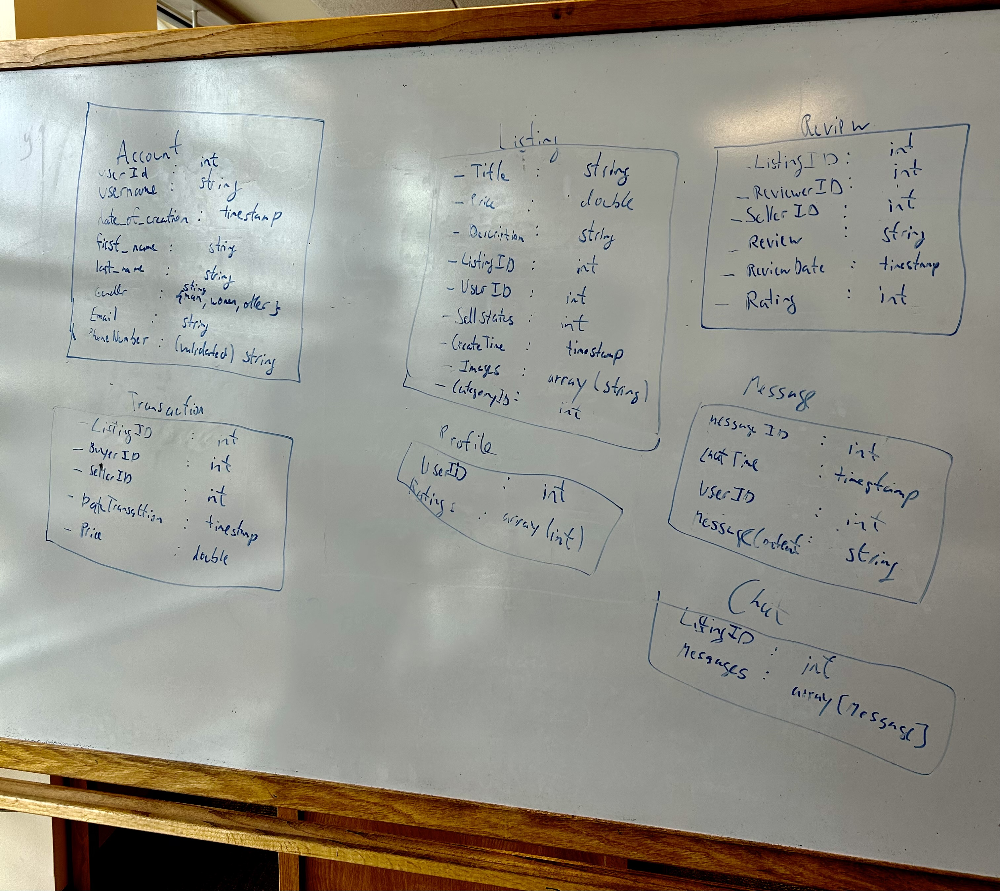

# Sprint 2 Journal

## Part 1: Coding Guidelines
   For each programming language that you will use in the implementation of your project, provide a link to a pre-existing coding style guideline that the members of your project will follow. Do not try to make up your own guidelines. Briefly state why you chose those guidelines and how you plan to enforce them.

Coding guidelines should appear in your Repository alongside any existing developer guidelines. Make sure the readme file in the root directory of your repo clearly describes where developer guidelines can be found.

 
## Part 2: Software Architecture

In your Sprint Journal, add an entry on the following:

* For each of two decisions pertaining to your software architecture, identify and briefly describe an alternative. For each of the two alternatives, discuss its pros and cons compared to your choice.
* * **Alternatives**  
  * Vercel:
  * Firebase - One alternative to Firebase database hosting is AWS Amplify, which offers a similar framework for web development in general and database implementation and maintenance specifically. 

  ##### Pros:
      * Compatible with SQL, NoSQL, and GraphQL
      * Allows for customization and fine-graining
      * Integrates nicely with other AWS infrastructure
  
  ##### Cons:
      * Harder to grasp for beginner developers
      * Complex pricing and subject to high costs piling up, whereas Firebase base free plan is likely to cover our needs
      * Might not integrate nicely with non-AWS infrastructure

## Part 3: Data Modeling
Data modeling: If your system stores data, describe in detail what data your system stores, and how. If it uses a database, give the first draft of your database schema. If not, describe how you are storing the data and its organization. To explain your data, you may find it helpful to draw an entity-relation diagram.

Add the data model to your Requirements Document.

Database design:

- The Account table holds initial account information which is filled at the time of account creation. This table contains a users personal information such as name, email and identifying information such as UserId and date of creation.
- The Listing table holds the information present on a particular listing. We have data about the listing like title, description, category and the identifying information is listing id and user id (the seller's id).
- The Reviews table holds 3 ids: selling, buying, listing. The content of the review is stored alongside the rating and the time of the review.
- The Transaction table holds the same ids as the review table alongside price and date of transaction.
- We have a seperate profile table that only holds userid and the user's rating. We may remove this table but as of now we wanted to seperate what is constant at account creation and what is added to an account later. If we add more changing fields tied to an account, they will be placed in this profile table. CHANGE FROM PHOTO: Purchased Listing and Sold Listings are stacks/arrays of listing ids included in profile.
- We have a message table containing the userid, message id, time of chat and message content. CHANGE FROM PHOTO: we have boolean saying whether the message came from the buyer or seller.
- Chat holds the array/stack of message ids tied to a listing.

## Part 4: Software Design
In your Requirements Document, provide a detailed definition of each of the software components you identified in your architecture.

* What packages, classes, or other units of abstraction form these components?
* What are the responsibilities of each of those parts of a component?
* Specify the interfaces between components in detail.
  * What kind of data gets passed between each pair of components? To minimize coupling, try to minimize the number of components that need to be connected to each other and keep the interfaces between components as small as possible.

Note that software design is distinct from architecture because it is more specific and detailed, providing additional detail about components that may only be a single rectangle the architecture diagram.

## Part 5: Process Description

### 5.1. Risk assessment
In your Sprint Journal, write an entry to identify the top three risks to successful completion of your project.

For each, give:

* Likelihood of occurring (high, medium, low)
* Impact if it occurs (high, medium, low)
* Evidence upon which you base your estimates, such as what information you have already gathered or what experiments you have done
* Steps you are taking to reduce the likelihood or impact, and steps to permit better estimates
* Plan for detecting the problem (trivial example: running automated tests to determine that a file format has changed)
* Mitigation plan should it occur
Be specific. If part of your risk analysis could be included in a different team's sprint journal, then you are probably not being specific enough.

#### Risk 1: Errors creating listings due to connection errors
 * Medium likelihood of occurring
   * Dependent on Internet connection, can happen often or not at all depending on where you are
 * High impact if it occurs
   * Potential to render website useless; if postings can't be made people can't buy things
 * To detect problem, we can attempt to post listing in place with spottier Internet and see if this causes problems
 * Mitigation idea: When creating a listing, automatically save it as a draft before posting
   * Updates as you add information, results in posting saving should you lose access
  
#### Risk 2: Self-reporting Timestamps when purchasing listing
 * High likelihood of occurring
   * Users likely to forget or neglect to add a timestamp
 * Medium impact if it occurs
   * Potential for scams to occur with greater frequency and ease
   * Listed as medium on the assumption not many people will attempt to game the system
 * To detect problem: If report is made, check if an entry for date + time sold exists.
 * To mitigate problem: Have entering the date and time be a requirement for confirming a purchase

### 5.2. Epics
An epic is a series of issues that come together to create an identifiable feature group. Completion of an epic may span multiple sprints.

#### Epic 1: Documentation
* **Description**: This epic's main goal is to finalize the bulk of our written work for ReuseU. This entails all of the files in our [requirements-guidelines](https://github.com/dicarlosofia/ReuseU/tree/main/requirements-guidelines) folder being close to their final version, as well as our README file.
* **Dependencies**: No other epics need to be done before we can start this epic. This epic is already in development with the bulk of what the ReuseU team is working on within Sprint 2.
* **Effort Est.**: This will take our whole team, for the written work is somewhat extensive. This will end up being 12 person-weeks. 
* **Subtasks**: These will be marked accordingly with the ***Epic 1*** Tag.

#### Epic 2: Beta Version Development
* **Description**: This epic's main goal is to begin developing the technical side of ReuseU, a.k.a. bringing all that we have written down on paper to life.
* **Dependencies**: We must have *most* of ***Epic 1*** done before we begin on this epic. This is because the written work is a necessary preliminary step to help the team have a more cohesive, parallel workflow when we all transition into a team of mostly developers.
* **Effort Est.**: This will take about 4 people for 2 and a half weeks, or 10 person-weeks. 
* **Subtasks**: These will be marked accordingly with the ***Epic 2*** Tag.

#### Epic 3: Final Version Development
* **Description**: This epic's main goal is to begin finalizing ReuseU as a website. At the end of this epic, ReuseU should be ready to be tentatively used by Grinnellians.
* **Dependencies**: We must have Epic 2 completed before we begin this epic.
* **Effort Est.**: This will take all 6 team members for two weeks minimum, so 12 person-weeks. 
* **Subtasks**: These will be marked accordingly with the ***Epic 3*** Tag.

### 5.3. Product Roadmap
In your Sprint Journal, create a timeline or calendar to represent your product roadmap. You might experiment with different text or graphical formats to make a calendar that is easy for your team  to understand. In your roadmap, include:

* Approximate start date of each epic
* Approximate completion date of each epic
* Enough time for flexibility in case your approximations are off

### 5.4. Documentation plan
In your Requirements Document, outline a plan for the documentation that you plan to deliver with the system, e.g., user guides, admin guides, developer guides, man pages, help menus, wikis, etc. Make sure to create corresponding issues in your Issue Manager.

 
## Part 6: Continuous Integration Plan

In your Sprint Journal, write a test plan, describing:

* Your test library (e.g., JUnit, Mocha, Pytest, etc).
* A brief justification for why you chose that test library.
* Your CI service and how your project repository is linked to it. (GitHub Actions is the recommended CI service.)
* A brief justification for why you chose that CI service.

In the Developer Guidelines section of your Repository, document what a developer needs to know about testing and CI, including:

* How to add a new test to the code base.
* Which tests will be executed in a CI build.
* Which development actions trigger a CI build.

## Part 7: Test Automation and Continuous Integration Setup
Add configuration to your Repository to enable automated tests and CI. You are not expected to provide an extensive test suite for your project at this point. Rather, the goal is to have the test infrastructure and CI set up with a few existing, example tests. (Your set up and the documented test-addition process should allow a developer on the team to easily add and run a new test.)

In your Sprint Journal, include a screenshot of your successful tests to demonstrate that they have run and passed.

## Part 8: Additional Work
Continue working towards your initial release by choosing work from your product backlog to complete this sprint. In your Sprint Planning and Sprint Review Documents you should clearly report which work is your chosen content for this sprint, and distinguish it from the required work.

If your additional work includes code, make sure that every component in the code base has corresponding test code.

